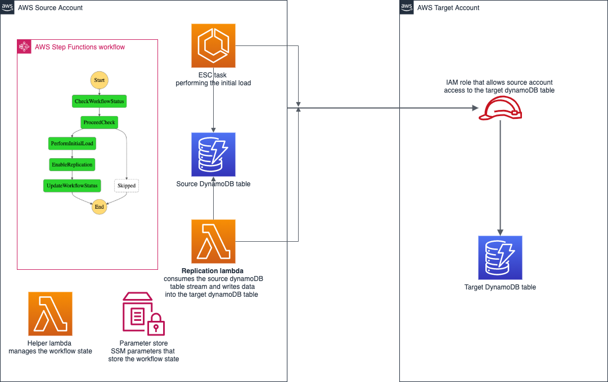

# Terraform module that manages DynamoDB data migration and ongoing replication 

Based on

 * https://aws.amazon.com/blogs/database/cross-account-replication-with-amazon-dynamodb/
 * https://github.com/aws-samples/cross-account-amazon-dynamodb-replication

## Pre-requisites
 * Enable dynamoDB streams on the source dynamoDB table
 * Create an IAM role in the target account that has full access to the target dynamoDB table. 
This role will be assumed by the glue job during the initial migration and the lambda 
during the ongoing replication.

## Post-migration
All resources should be deleted once the dynamoDB replication is no longer required.
 
 * Perform terraform destroy on this module (or just dereference it from your stack and 
 let terraform tidy the resources up)
 * Disable the source table dynamoDB stream
 * Remove the role created as part of pre-req 
 
## Example
Simple example setup can be found in the examples folder

## Inputs

| Name | Description | Type | Default | Required |
|------|-------------|------|---------|:--------:|
| enabled | Indicates if the replication is enabled | `bool` | `false` | no |
| glue\_number\_of\_workers | Number of glue workers. See https://docs.aws.amazon.com/glue/latest/dg/add-job.html | `number` | `145` | no |
| glue\_worker\_type | Glue worker type. See https://docs.aws.amazon.com/glue/latest/dg/add-job.html | `string` | `"G2.X"` | no |
| namespace | Namespace this resources belong to | `string` | n/a | yes |
| source\_table\_name | Source Dynamo DB table name | `string` | n/a | yes |
| source\_table\_stream\_arn | Source Dynamo DB table stream ARN | `string` | n/a | yes |
| stage | Deployment stage | `string` | n/a | yes |
| tags | A map of tags to assign to the resource. | `map(string)` | n/a | yes |
| target\_account | Target AWS Account Number | `string` | n/a | yes |
| target\_dynamodb\_table\_name | Target DynamoDB Table name | `string` | n/a | yes |
| target\_region | The region for the target DynamoDB table | `string` | n/a | yes |
| target\_role\_name | Target IAM Role name to be assumed by Lambda function and a Glue job | `string` | n/a | yes |

## Outputs

No output.

